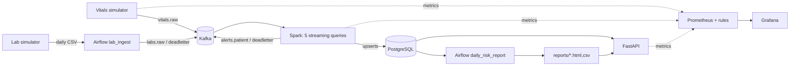

# Ward Vital Signs Monitoring - Big Data Pipeline

Near-real-time monitoring of bedside patient vitals, correlated daily with pathology lab
results, to answer: **which patients show concerning vital-sign trends right now, and how do
yesterday's lab results change their risk going forward?**

> **Disclaimer.** All data is synthetic. The risk score is a simplified, NEWS2-*style*
> illustration built for a data-engineering exercise. It is **not** a clinical tool and must not
> be used for any medical decision.

## Architecture

Kappa architecture: every input (vitals and lab rows) flows through Kafka, and one Spark
Structured Streaming application produces every derived table. Airflow ingests the daily lab
file into Kafka and schedules the daily report; FastAPI serves the results; Prometheus and
Grafana observe every stage.

Full decision record, diagram, topic and table design:
[docs/architecture_decision.md](docs/architecture_decision.md).



| Layer | Technology | Why it fits *this* ward |
|---|---|---|
| Ingestion | Apache Kafka 4.1 (KRaft, single broker) | Durable, replayable log = the Kappa source of truth; keying by `patient_id` keeps each patient's readings ordered for trend detection; KRaft drops the ZooKeeper JVM on a laptop |
| Stream processing | Apache Spark 4.1 Structured Streaming (local mode) | Event-time windows, watermarks, de-duplication and checkpointed exactly-once *effects* out of the box; `VARIANT` parsing for strict validation; one JVM in local mode |
| Orchestration | Apache Airflow 3.1 (LocalExecutor) | The lab feed is a daily file with an SLA: sensors, retries, callbacks and asset-triggered chaining are exactly Airflow's job; LocalExecutor avoids Redis/Celery |
| Storage | PostgreSQL 17 | Spark stores small pre-aggregated rows, so upserts on natural keys (idempotency) matter more than time-series compression; TimescaleDB rejected (see ADR §7) |
| Serving | FastAPI | Typed, validated, self-documenting endpoints (`/docs`) with dependency injection that makes the API testable without a database |
| Observability | JSON logs, Prometheus, Grafana | Pull-based metrics from every stage, rule-based alerts with unit tests (`promtool`), a dashboard provisioned as code |

## Prerequisites

- Docker Desktop with **at least 8 GB** of memory assigned (Settings → Resources)
- GNU Make and Python 3.10+ (for `make env` and the unit tests)

## Quick start

```bash
make env      # create .env with generated secrets (once)
make up       # build images and start the stack
make ps       # all long-running services should be "healthy"
```

| Service | URL | Login |
|---|---|---|
| Ward API | http://localhost:8000/docs | - |
| Airflow | http://localhost:8080 | `admin` / `AIRFLOW_ADMIN_PASSWORD` from `.env` |
| Grafana | http://localhost:3000 | `admin` / `GRAFANA_ADMIN_PASSWORD` from `.env` |
| Prometheus | http://localhost:9090 | - |
| Spark UI | http://localhost:4040 | while the streaming job runs |
| Postgres | `localhost:5433`, db `ward` | `ward` / `WARD_DB_PASSWORD` |
| Kafka (from host) | `localhost:9094` | - |

Stop with `make down` (keeps data, pauses the simulated clock). `make clean` deletes all data.
Run `make help` for every target.

## Simulated clock

Default: **1 simulated day = 5 real minutes** (`SIM_DAY_SECONDS=300`, a ×288 speed-up).

```
sim_now = anchor_sim + (real_now − anchor_real) × 86400 / SIM_DAY_SECONDS
```

The anchor is stored in the Postgres table `sim_clock`, so every container agrees on the
simulated time. All event timestamps, windows, lab dates and reports use simulated time.
`make down` pauses the clock and `make up` resumes it without a jump.

| Simulated | Real (default) |
|---|---|
| 1 day | 5 min |
| 1 hour | 12.5 s |
| ~5 min | ~1 s |

Inspect it with `make clock-show`, or in SQL with `SELECT sim_now();`.

## Running the pipeline

### Vitals simulator (streaming source)

Starts automatically with `make up` as the `vitals-simulator` service and publishes JSON
readings to `vitals.raw`, keyed by `patient_id`.

```json
{"schema_version":1,"event_id":"46fe7133-…","patient_id":"P009","heart_rate":65,"spo2":98,
 "systolic_bp":97,"diastolic_bp":65,"temperature":36.5,
 "timestamp":"2026-01-04T07:01:41.695Z","produced_at":"2026-09-30T12:03:54.120Z"}
```

`timestamp` is simulated event time (used for windows); `produced_at` is real time (used only
for latency). Each patient follows a hidden storyline - `stable`, `sepsis`,
`respiratory_failure`, `haemorrhage` or `recovering` - with gradual, recurring deterioration
episodes, plus random short spikes. The storyline is stored in the `patients` table as ground
truth for evaluation and is never sent in the stream.

Configuration (`.env` or CLI flags):

| Variable | Flag | Default | Meaning |
|---|---|---|---|
| `SIM_PATIENTS` | `--patients` | 20 | Patients on the ward |
| `SIM_RATE` | `--rate` | 20 | Total readings per real second |
| `SIM_SEED` | `--seed` | 42 | Same seed → same patients and storylines |
| `SIM_SPIKE_RATE` | `--spike-rate` | 0.01 | Chance a transient spike starts per reading |
| `SIM_MALFORMED_RATE` | `--malformed-rate` | 0.02 | Broken payloads (→ dead-letter) |
| `SIM_LATE_RATE` | `--late-rate` | 0.02 | Readings delivered 5-120 sim-minutes late |
| `SIM_DUPLICATE_RATE` | `--duplicate-rate` | 0.01 | Readings sent twice with the same `event_id` |

Useful commands:

```bash
make sim-dry                  # print 5 s of readings, no Kafka/DB needed
make consume n=5              # newest messages on vitals.raw
make offsets                  # messages per partition
make logs s=vitals-simulator  # includes deterioration_started / _resolved events
curl localhost:8001/metrics   # producer metrics
```

### Lab simulator (daily batch source)

The `lab-simulator` service writes one CSV per simulated day to `data/landing/`:
`labs_YYYY-MM-DD.csv` holds results **collected on** that day and is uploaded at 06:00
(simulated) the next morning - "yesterday's labs".

```csv
sample_id,patient_id,test_type,result_value,unit,reference_range,collected_at
20260104-P014-AM,P014,CRP,181.9,mg/L,<5,2026-01-04T07:41:12Z
```

The brief's five columns plus `sample_id` (one blood sample → several tests) and `unit`.

| Test | Unit | Reference range |
|---|---|---|
| WBC | 10^9/L | 4.0-11.0 |
| CRP | mg/L | <5 |
| LACTATE | mmol/L | 0.5-2.0 |
| CREATININE | umol/L | 59-104 (M), 45-84 (F) |
| POTASSIUM | mmol/L | 3.5-5.3 |
| HAEMOGLOBIN | g/L | 130-180 (M), 115-165 (F) |
| TROPONIN | ng/L | <14 |

- Results follow the same hidden storyline as the vitals (same seed), with realistic lags:
  lactate and haemoglobin respond immediately, CRP peaks ~18 simulated hours later.
- Everyone gets morning bloods (routine panel); unwell patients also get lactate/troponin and
  an evening re-check.
- ~3% bad rows: missing or unknown patient, non-numeric (`haemolysed`), implausible values,
  unknown test codes, malformed reference ranges or timestamps, wrong day, duplicate rows.
- ~10% of files arrive 2-8 simulated hours late and ~5% never arrive.
- Files are written atomically (temp file + rename) and are byte-for-byte reproducible.

| Variable | Default | Meaning |
|---|---|---|
| `LAB_UPLOAD_HOUR` | 6 | Simulated hour on D+1 when day D's file is uploaded |
| `LAB_LATE_RATE` / `LAB_LATE_MAX_HOURS` | 0.10 / 8 | Late uploads |
| `LAB_MISSING_RATE` | 0.05 | Files that never arrive |
| `LAB_BAD_ROW_RATE` | 0.03 | Corrupted rows |

```bash
make landing                       # files in landing/ archive/ quarantine/
make lab-dry d=2026-01-04          # print a day's CSV without writing it
make lab-day d=2026-01-04 f=--force   # (re)deliver a day now, e.g. after a "missing" day
curl localhost:8002/metrics        # lab_files_written_total, lab_files_withheld_total, ...
```

### Stream processing (Spark)

One Spark application (`spark` service, local mode) runs five streaming queries:

| Query | Input | Output |
|---|---|---|
| `vitals_quality` | `vitals.raw` | validity counts (metrics); invalid records → `deadletter` |
| `vitals_windows` | `vitals.raw` | 1 h windows + EWS + lab join → `vitals_window_1h`, `patient_live_status`, `alerts` (+ `alerts.patient`) |
| `vitals_trends` | `vitals.raw` | 4 h/1 h sliding slopes (append mode: each window once, complete) → `vitals_trend_4h`, trend alerts |
| `labs` | `labs.raw` | `lab_results` (invalid → `deadletter`) |
| `deadletter_sink` | `deadletter` | `dead_letter` table |

Windows and the watermark are in simulated time (1 h window = 12.5 real s; watermark
30 sim-min = 6.25 real s). Scoring rules live in `common/ward_common/scoring_rules.py`
(illustrative NEWS2-style score - not clinical).

```bash
make stream-status        # row counts of the derived tables
make logs s=spark         # alert_raised events, query progress
curl localhost:8003/metrics | grep ^spark_   # lag, batch duration, watermark drops, ...
make stream-reset         # Kappa replay: wipe derived tables + checkpoints, rebuild from Kafka
make spark-test           # Spark unit/parity tests (run inside the Spark image)
```

Changing window sizes, the watermark or `spark.sql.shuffle.partitions` changes the state
layout, so it needs `make stream-reset`.

### Lab ingestion (Airflow)

DAG `lab_ingest` (Airflow UI → http://localhost:8080) runs once per simulated day:

1. `resolve_target_day` - yesterday in simulated time.
2. `wait_for_lab_file` - sensor (reschedule mode). If the file is not in `landing/` by
   06:00 + `LAB_SLA_HOURS` (simulated), the day is recorded as **missing** and the task fails.
3. `load_landing_files` - runs regardless and processes every waiting file: sha256 checksum,
   header check, row validation (shared validator + in-file duplicates), then either publishes
   valid rows to `labs.raw` and rejected rows to `deadletter`, or quarantines the whole file
   (> `LAB_MAX_REJECT_RATE` bad rows). Files end up in `data/archive/` or `data/quarantine/`.

Nothing in Airflow writes lab results to Postgres: Spark consumes `labs.raw` (Kappa).

```bash
make lab-loads                                   # per-day ledger: status, arrival, DQ counts
make dag-trigger d=lab_ingest                    # run now instead of waiting
make lab-day d=2026-01-10 f=--force              # identical re-delivery -> skipped as duplicate
make lab-day d=2026-01-02 f="--bad-row-rate 0.6" # mostly-bad file -> quarantined
docker compose stop lab-simulator                # -> next day recorded as missing
```

| Variable | Default | Meaning |
|---|---|---|
| `LAB_SLA_HOURS` | 4 | Simulated hours after the 06:00 upload before a file counts as missing |
| `LAB_MAX_REJECT_RATE` | 0.2 | Quarantine the file above this fraction of bad rows |
| `LAB_POKE_SECONDS` | 10 | Sensor poke interval (real seconds) |

### Daily risk report (Airflow)

DAG `daily_risk_report` is triggered by the lab asset every time `lab_ingest` finishes. For
simulated day D it waits (briefly) for Spark to load D's labs, then joins in SQL + Python:

- **vitals**: end-of-day EWS from the reading-weighted averages of D's last 4 hours, peak EWS,
  hours at HIGH/MEDIUM, extremes;
- **trends**: last trend of the day and number of deteriorating 4 h windows;
- **alerts** raised during D by severity;
- **labs**: latest result per test collected in the 48 h up to the end of D.

Each patient gets a *vitals-only* tier and a tier *with labs*; the report highlights patients
whose tier the labs raised - the business question. Output: `daily_risk_report` table and
`reports/risk_report_<D>.html` / `.csv` (also served by the API). Same scoring rules as the
stream job (`scoring_rules.py`).

### Serving API (FastAPI)

Interactive docs at http://localhost:8000/docs.

| Endpoint | Purpose |
|---|---|
| `GET /ward/summary` | Live tiers, active alerts by severity, ward averages, data freshness, latest lab file and report |
| `GET /patients?tier=` | All patients with their live score, highest risk first |
| `GET /patients/{id}` | Live status, latest labs (flagged if they count toward the score), active alert count |
| `GET /patients/{id}/vitals?hours=` | 1 h window aggregates and scores |
| `GET /patients/{id}/trends?hours=` | 4 h slopes, deterioration index, trend |
| `GET /alerts?severity=&patient_id=&hours=&include_acknowledged=` | Alerts, most severe first |
| `POST /alerts/{id}/acknowledge` | Acknowledge an alert |
| `GET /reports/latest`, `GET /reports/{date}` | Daily consolidated risk report |
| `GET /reports/{date}/html` \| `/csv` | Rendered report files |
| `GET /health` | Liveness + Postgres and sim-clock checks (503 when degraded) |
| `GET /metrics` | Prometheus: HTTP metrics + pipeline/batch/storage state read at scrape time |

### Observability

- **Logs**: every Python component writes one JSON object per line (`service`, `event`,
  fields) - `make logs s=<service> | jq`.
- **Metrics** (Prometheus, http://localhost:9090/targets): vitals simulator (`:8001`), lab
  simulator (`:8002`), Spark driver (`:8003` - per-query rates, Kafka lag, batch duration,
  watermark drops, invalid records, end-to-end latency) and the API (`:8000` - HTTP metrics,
  lab ledger, Airflow task outcomes, table sizes, live tiers).
- **Alert rules** (`observability/prometheus/alert_rules.yml`, 15 rules, unit-tested with
  `promtool`), including the three required ones:

  | Alert | Fires when |
  |---|---|
  | `VitalsNotReceived` | no vitals micro-batch processed for 2 real minutes |
  | `HighInvalidRecordRate` | > 5 % of vitals dead-lettered over 5 minutes |
  | `LabFileMissing` / `LabFileLate` | yesterday's file not received by 06:00 + 4 h (sim) / > 2 h late |

- **Dashboard**: Grafana → *Ward Monitoring → Ward vitals pipeline* (provisioned; generated by
  `observability/grafana/build_dashboard.py`, `make dashboard`): KPI row, ingestion,
  processing, batch, storage & serving, live ward tables from Postgres, firing alerts.
- **Health checks**: every long-running container has a Docker health check (`make ps`).

## Reproducing results

From a clean checkout (≈ 10 minutes of real time = 2 simulated days of data):

```bash
make env && make venv && make up        # everything healthy after ~2 min (make ps)
make test-all                           # 154 local + 15 Spark + 6 Airflow tests, promtool rules
make stream-status                      # derived tables filling
make lab-loads                          # a ledger row per simulated day
curl -s localhost:8000/ward/summary | jq
curl -s localhost:8000/reports/latest | jq '.tiers, .escalated_by_labs'
open http://localhost:3000              # dashboard
```

Robustness experiments (each is reversible):

| Experiment | Command | Expected |
|---|---|---|
| Kappa replay | `echo y \| make stream-reset` | all derived tables rebuilt from Kafka; lag back to 0 in < 1 min |
| Restart from checkpoint | `docker compose restart spark` | no duplicate alerts, no reprocessing |
| Bad data burst | `SIM_MALFORMED_RATE=0.15 docker compose up -d vitals-simulator` | `HighInvalidRecordRate` fires in ~2.5 min |
| Source outage | `docker compose stop vitals-simulator` | `VitalsProducerSilent`, then `VitalsNotReceived` (~3 min) |
| Missing lab file | `docker compose stop lab-simulator` | `LabFileLate` → `LabFileMissing`; day recorded `missing`; restart → `loaded/late` |
| Duplicate lab file | `make lab-day d=<loaded day> f=--force` | skipped by checksum (`duplicate_deliveries` + 1) |
| Mostly-bad lab file | `make lab-day d=<day> f="--bad-row-rate 0.6"` | quarantined, nothing published |

Restore with `docker compose up -d vitals-simulator lab-simulator`. Measured results are in
[docs/report_notes.md](docs/report_notes.md); a timed walkthrough is in
[docs/demo_script.md](docs/demo_script.md).

## Tests

```bash
make venv       # once
make test       # local: simulators, contracts, scoring rules, ingestion DQ, report, API, dashboard
make spark-test # Spark parsing/scoring parity, windows, alerts (inside the Spark image)
make airflow-test  # DAG integrity (inside the Airflow image)
make test-alerts   # promtool: Prometheus config + alert-rule unit tests
make test-all      # all of the above
```

## Repository layout

```
common/ward_common/     shared package: config, sim clock, JSON logging, event contracts, scoring rules
simulators/ward_sim/    vitals producer and lab file generator
spark/jobs/             streaming job (ward_stream/: parsing, windows, scoring, alerts, sinks, metrics)
airflow/dags/           lab_ingest + daily_risk_report DAGs (ward_ingest/: DQ, publishing, report)
api/app/                FastAPI app, repository, models, metrics
db/init/                roles, databases and numbered SQL migrations
kafka/                  topic provisioning
observability/          Prometheus config + alert rules, Grafana provisioning + dashboard generator
tests/                  local tests; tests/spark, tests/airflow, tests/prometheus run in their images
docs/                   architecture decision, report notes, demo script
data/, reports/         runtime data (git-ignored contents)
```

## Assumptions and limitations

- **Synthetic, illustrative only.** Patients, vitals and labs are generated; the NEWS2-style
  score omits respiratory rate, consciousness and supplemental oxygen and is not clinical.
- **Single node.** One Kafka broker (RF = 1), Spark in local mode, one Postgres: no fault
  tolerance against losing the laptop. Production values are in `docs/report_notes.md`.
- **Replay ordering.** During a Kappa replay the vitals and labs queries run independently, so
  early replayed windows can be scored before their labs are reloaded.
- **Report timing.** The daily report waits a bounded time for Spark to load the day's labs;
  if Spark is down it is produced with the lab status flagged.
- **Trend latency.** Trend windows are emitted when complete (~4.5 sim-hours ≈ 1 real minute
  after they open); instantaneous danger is covered by threshold alerts.
- **Clock.** Simulated time pauses on `make down`; a plain `docker compose down` does not
  pause it, so simulated days pass while the stack is stopped.
- **Security.** Local-only: ports bound to 127.0.0.1, plaintext Kafka and Postgres, no API
  authentication. Secrets come from a generated `.env`.

## Individual contributions

| Member | Student Reg No | Project Roles & Key Technical Contributions |
|---|---|---|
| K.P.D. Anjitha | EG/2021/4403 | Lead Stream Processing & Clinical Logic: PySpark Structured Streaming engine (`spark/jobs/`), 5-min tumbling windows, 10-min watermarking, Royal College of Physicians NEWS2 clinical scoring engine, stream-static dimension joins with PostgreSQL, sepsis risk tier elevation logic, Kafka/Postgres sinks. |
| R.M.C.V. Rajapaksha | EG/2021/4733 | Lead Serving, Observability & Verification: FastAPI REST service (`api/`), clinical REST endpoints, Pydantic data models, Prometheus custom metrics exporter, 15 Alertmanager rules, Grafana real-time ward monitoring dashboard, comprehensive 16-assertion test suite (`tests/`). |
| H.M.V.U. Weerabandara | EG/2021/4853 | Lead Data Platform & Batch Orchestration: Docker Compose infrastructure orchestration, PostgreSQL DDL schema & reference tables (`db/`), Kafka topic provisioning scripts, simulated patient telemetry generator (`simulators/`), Apache Airflow daily batch DAGs & SLA monitoring (`airflow/`). |
