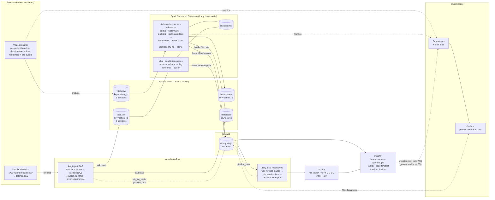

# Architecture Decision Record - Ward Vital Signs Monitoring Pipeline

| Field    | Value                                              |
|----------|----------------------------------------------------|
| Status   | Accepted                                           |
| Date     | 2026-09-30                                         |
| Decision | **Kappa architecture** (single streaming path, Kafka as the replayable source of truth) |
| Rejected | Lambda architecture (separate batch + speed layers) |

> **Disclaimer.** All data in this project is synthetic. The risk score is a simplified,
> NEWS2-*style* illustration built for a data-engineering exercise. It is **not** a clinical
> tool and must not be used for any medical decision.

---

## 1. Context

A hospital ward needs:

1. **Near-real-time** visibility of patient vitals from bedside monitors
   (`patient_id, heart_rate, spo2, systolic_bp, diastolic_bp, temperature, timestamp`),
   emitted every few seconds per patient.
2. **Once-a-day** lab results from pathology
   (`patient_id, test_type, result_value, reference_range, collected_at`), one file per day.
3. Answers to: *which patients show concerning vital-sign trends right now*, and *how do
   yesterday's labs change the risk picture going forward*.

Outputs: real-time API figures, threshold-based per-patient alerts, and a daily consolidated
risk report joining vitals trends with the latest labs.

### Workload profile (drives every decision below)

| Property | Vitals | Labs |
|---|---|---|
| Arrival | Continuous, unbounded | One file per simulated day |
| Volume (default config) | 20 patients × 1 reading/real-second ≈ 20 events/s | ~20 patients × ~7 tests ≈ 150 rows/day |
| Latency need | Seconds (alerts) | Minutes (next report / next risk update) |
| Ordering need | Per patient (trend/slope detection) | Per patient, latest-wins |
| Correction/replay need | Yes - fix scoring logic and recompute | Yes - re-load a bad file idempotently |

The key observation: **the only genuinely "batch" input is tiny** (hundreds of rows per day).
Nothing in this use case needs a heavyweight batch recomputation over a huge master dataset.

---

## 2. Options considered

### Option A - Lambda

- **Batch layer:** raw vitals + labs land in an immutable master store (Parquet); a nightly
  Spark batch job recomputes accurate daily views (trends, scores, joins).
- **Speed layer:** Spark Structured Streaming computes approximate real-time views for
  alerts and the API.
- **Serving layer:** merges batch views (authoritative, older) with speed views (recent).

### Option B - Kappa (recommended)

- **One log:** every input - vitals *and* lab rows - enters Kafka. Kafka (with adequate
  retention) is the replayable source of truth.
- **One processing path:** a single Spark Structured Streaming application validates, windows,
  scores, joins with labs and writes idempotently to PostgreSQL.
- **Reprocessing = replay:** to fix logic, deploy the new job with a fresh checkpoint and
  consumer position `earliest`, let it rebuild the tables (or new versioned tables), then switch.
- **Airflow's role** is *ingestion adapter and report scheduler*, not a second computation
  layer: it senses the daily lab file, validates it, publishes the rows into Kafka, and later
  renders the daily report from tables the stream job already maintains.

---

## 3. Comparison against this use case

| Criterion | Lambda | Kappa | Winner for *this* ward |
|---|---|---|---|
| **Latency** | Speed layer gives seconds; batch views lag up to 1 sim day | Seconds for everything, including lab effects (labs feed the live score as soon as they are published) | **Kappa** - "how do labs change the risk picture *going forward*" is answered immediately, not after the next batch run |
| **Replay / reprocessing** | Recompute from master Parquet with the batch code | Replay Kafka topics from `earliest` through the *same* streaming code | **Kappa** - our retention (see §6) easily covers the whole demo history; the batch input is small enough to keep in Kafka indefinitely |
| **Consistency** | Two implementations of scoring/trend logic (batch + streaming) must be kept identical; divergence produces different numbers in the API vs report - a real safety concern on a ward | One implementation; the API, alerts and daily report all read tables produced by the same code | **Kappa** - single source of logic is the strongest argument |
| **Cost / resources** | Streaming job + batch Spark jobs + merge logic; more RAM on a laptop, more code to test | One Spark app (local mode, 3 queries), Airflow only runs lightweight Python tasks | **Kappa** - fits comfortably in a laptop's Docker memory budget |
| **Operational complexity** | Two pipelines to monitor, two failure modes, merge semantics in serving | One pipeline; checkpoints + idempotent sinks give exactly-once *effects* | **Kappa** |
| **Where Lambda would win** | Very large historical recompute (years of data), heavy ML retraining, data too big to keep in the log | Weak if log retention is short or reprocessing must scan terabytes | Not our situation |

### Decision

**Adopt Kappa.** The deciding factors are **consistency** (one scoring implementation shared by
alerts, API and report) and **latency of lab impact** (labs update live risk the moment they
are published). Replay is realistic because the data volume is small and Kafka retention is
configured to cover the full simulated history.

### Why Lambda is rejected (for the viva)

1. The "batch" data is ~150 rows/day - a batch *layer* would be infrastructure without a workload.
2. Duplicating NEWS2-style scoring and trend logic in two code paths risks the API and the daily
   report disagreeing about the same patient. In a clinical-monitoring context, contradictory
   numbers are worse than slightly late numbers.
3. It would roughly double the Spark footprint on a single laptop.

### Honest trade-offs we accept

- **Replay time grows with history, and history is bounded by retention.** Mitigation: vitals
  retention (7 real days ≈ 2,000 sim days) far exceeds any demo run. Long-term raw archival
  (e.g. Kafka → Parquet/object storage) is deliberately out of scope for the laptop build and
  listed as a production improvement.
- **Kafka becomes critical state.** Mitigation: single broker is acceptable for a laptop demo;
  production would use RF=3, `min.insync.replicas=2` (documented in report notes).
- **Stream-table join semantics.** Labs are joined per micro-batch against the latest lab
  snapshot, so a vitals window computed *before* a lab arrives is not retro-scored. This is the
  intended semantics ("going forward"), and the daily report re-joins the full day explicitly.

---

## 4. Architecture diagram



---

## 5. Simulated clock

All components share one definition of "simulated time" (implemented once in the shared
`common/` package and imported everywhere).

| Setting (`.env`) | Default | Meaning |
|---|---|---|
| `SIM_DAY_SECONDS` | `300` | Real seconds per simulated day (1 sim day = 5 real min) |
| `SIM_START_DATE` | `2026-01-01` | Simulated date at the clock anchor |
| anchor | Postgres table `sim_clock` (one row) | (`anchor_real`, `anchor_sim`) pair, plus `paused_at` |

```
speedup  = 86400 / sim_day_seconds            # 288 by default
sim_now  = anchor_sim + (min(real_now, paused_at) − anchor_real) × speedup
```

- The anchor lives in the database, not in each container, so every component computes the
  same simulated time. Implemented once in `ward_common.sim_clock` (Python) and mirrored by the
  SQL function `sim_now()` (for Grafana and ad-hoc queries).
- The one-shot `clock-init` service runs on every `make up`:
  - empty table → anchor `SIM_START_DATE 00:00` to the current real time;
  - existing row → **re-anchor at the current simulated time**, so the clock continues
    without a jump (this also makes a changed `SIM_DAY_SECONDS` take effect smoothly).
- `make down` sets `paused_at` first, so simulated days are not "lost" while the stack is
  offline. `make clean` deletes the table with everything else and the next start begins at
  `SIM_START_DATE` again.
- Long-running components re-read the anchor every `SIM_CLOCK_REFRESH_SECONDS` (30 s) and keep
  the last known value during a brief database outage.
- **All event timestamps are simulated time.** Spark windows, watermarks, lab `collected_at`,
  report dates and API responses are all in sim time. Real time is only used for
  infrastructure concerns (Prometheus scrape, alert "no data for N real minutes").

Reference conversions at the default speed-up (×288):

| Simulated | Real | Used for |
|---|---|---|
| 1 day | 5 min | Lab file cadence, report cadence |
| 4 hours | 50 s | Sliding trend window length |
| 1 hour | 12.5 s | Tumbling window, sliding step |
| 30 min | ~6 s | Watermark (allowed lateness) |
| ~5 min | ~1 s | Default reading interval per patient |

Window sizes are configured in **simulated** units, so changing `SIM_DAY_SECONDS` keeps the
clinical meaning of the windows intact.

---

## 6. Kafka topic design

Single broker in **KRaft mode** (no ZooKeeper - one less JVM on the laptop). Replication
factor 1 locally; production values noted for the report.

| Topic | Key | Partitions | Retention | Producer | Consumer | Why |
|---|---|---|---|---|---|---|
| `vitals.raw` | `patient_id` | 6 | 7 real days (≈ 2,000 sim days) | vitals simulator | Spark Q1 | Keying by patient guarantees per-patient ordering inside a partition, which trend/slope detection relies on. 6 partitions ≥ Spark local cores, headroom for more patients |
| `labs.raw` | `patient_id` | 3 | unlimited (`retention.ms=-1`) | Airflow `lab_ingest` | Spark Q2 | Tiny volume; kept forever so a full Kappa replay can rebuild lab state |
| `alerts.patient` | `patient_id` | 3 | 7 real days | Spark Q1 | (future) paging/notification service | Alerts are themselves an event stream; decouples notification from processing |
| `deadletter` | source (`vitals`/`labs`) | 1 | 7 real days | simulators' parse layer, Spark, Airflow | ops / replay tool | Invalid records are kept with the reason and original bytes for inspection and replay |

Producer settings: `acks=all`, `enable.idempotence=true`, `linger.ms` small (batching without
hurting latency), JSON values with a `schema_version` field.

---

## 7. PostgreSQL table design (database `ward`)

**Why plain PostgreSQL, not TimescaleDB:** Spark already performs the time-bucketing and
windowed aggregation, so Postgres stores *pre-aggregated* rows (≈ 20 patients × 24 windows per
sim day), not raw high-frequency readings. Timescale's hypertables and continuous aggregates
would duplicate work Spark already does. Raw readings stay in Kafka (the Kappa log) for replay
rather than being copied into Postgres. A second database `airflow` in the same Postgres instance holds Airflow metadata (saves
one container's RAM).

| Table | Primary / unique key | Written by | Purpose |
|---|---|---|---|
| `sim_clock` | singleton | init step | Shared anchor for simulated time |
| `patients` | `patient_id` | seed script | Bed, age band, baseline profile, scenario (dimension table) |
| `vitals_window_1h` | (`patient_id`, `window_start`) | Spark Q1 | Tumbling 1 sim-hour aggregates: count, mean/min/max of each vital, window EWS score |
| `vitals_trend_4h` | (`patient_id`, `window_start`) | Spark Q1 | Sliding 4 h / 1 h-step windows: per-vital linear slope, deterioration/improvement index, `trend` (deteriorating / improving / stable / insufficient_data) |
| `patient_live_status` | `patient_id` | Spark Q1 | One row per patient: latest vitals, live EWS, lab adjustment, adjusted score, risk tier, `updated_at` - powers the ward API |
| `alerts` | `alert_id` = hash(patient, type, window_start) | Spark Q1 | Threshold and trend alerts; deterministic ID makes re-writes after a restart idempotent |
| `lab_results` | (`sample_id`, `test_type`) | Spark Q2 | Validated lab rows with parsed `ref_low`/`ref_high`, `abnormal_flag`, `source_file` (one blood sample → several tests) |
| `lab_latest` (view) | - | - | `DISTINCT ON (patient_id, test_type)` latest result |
| `lab_file_loads` | `file_day` | Airflow | Ledger per simulated day: status (loaded / quarantined / missing), arrival (on_time / late / missing), sha256 checksum, rows total/valid/rejected, reject reasons (jsonb), deliveries and duplicate-delivery counters. An identical re-delivery is recognised by checksum and not republished |
| `dead_letter` | (`source`, `origin`) - origin is `topic:partition:offset` or `file:row` | Spark (from the `deadletter` topic) | Queryable copy of every rejected record with its `error_reasons`, whichever stage rejected it |
| `daily_risk_report` | (`report_date`, `patient_id`) | Airflow | Final joined features, base score, lab adjustment, trend adjustment, risk tier |
| `pipeline_runs` | (`dag_id`, `run_id`, `task_id`, `try_number`) | Airflow task callbacks | Task outcome, duration and error - source for batch success/failure and duration metrics |
| `daily_risk_report` | (`report_date`, `patient_id`) | Airflow `daily_risk_report` | Per patient per simulated day: vitals features, trend, alerts, latest labs (jsonb), vitals-only tier vs tier with labs, `tier_change` |

All writes are **upserts** (`INSERT … ON CONFLICT … DO UPDATE`) keyed on natural keys, so Spark
micro-batch retries and Airflow re-runs never duplicate data.

---

## 8. Processing logic summary (what makes it more than pass-through)

1. **Validation & cleaning** - payloads are parsed into Spark 4's `VARIANT` type so JSON types
   are preserved; checks for missing fields, wrong types, physiological plausibility (e.g. HR
   20-250, SpO₂ 50-100, temp 30-43 °C), diastolic < systolic, timezone-qualified timestamps and
   unknown patients (stream-static join with `patients`). Same error codes as the Python contract
   (parity-tested). Invalid → `deadletter` topic with reasons.
2. **De-duplication & late data** - `dropDuplicatesWithinWatermark(event_id)` removes duplicate
   deliveries; a 30 sim-min event-time watermark bounds state, and rows later than it are
   dropped and counted (`numRowsDroppedByWatermark` → Prometheus).
3. **Windowed aggregation** - tumbling 1 sim-hour and sliding 4 sim-hour/1 sim-hour windows.
4. **Trend detection** - least-squares slope per vital inside the sliding window
   (`try_divide(covar_pop(value, t), var_pop(t))`). Each slope is scaled by the slope noise of
   stable patients and summed in the worsening direction (deterioration index). Calibrated on
   the simulator: index ≥ 5 catches ~76 % of worsening 4 h windows at ~1 % false positives in
   stable patients; single-vital thresholds could not separate slow sepsis from noise.
5. **Live early-warning score** - NEWS2-style points for HR, SpO₂, systolic BP, temperature
   (respiratory rate, consciousness and O₂ therapy are not in the feed, so the score is partial
   and documented as such).
6. **Stream/batch join** - each micro-batch of windows is joined (in Spark) with the lab results
   collected in the 48 h before each window ended, read fresh from Postgres per micro-batch and
   limited to the batch's time range (so a replay joins historically correct labs). The latest
   value per test scores against `LAB_RULES` (lactate, CRP, WBC, creatinine, potassium,
   haemoglobin, troponin), capped at +4.
7. **Risk tier** - Low / Medium / High from the adjusted score, with a "single red parameter"
   escalation rule.
8. **Alerts** - threshold breaches needing ≥ 2 readings in the window (a single artefact does
   not page anyone), HIGH risk tier, and sustained deterioration trends. Deterministic
   `alert_id`; new alerts are also published to `alerts.patient`.
9. **Daily report** (Airflow) - joins day D's trends and window scores with labs collected on D,
   producing the consolidated per-patient risk table in HTML + CSV.

Scoring bands and lab weights live in **one shared module** (`common/scoring_rules.py`); Spark
builds column expressions from it and the report/API reuse it, which enforces the Kappa
consistency argument in code.

---

## 9. Robustness

| Concern | Mechanism |
|---|---|
| Malformed events | `VARIANT` parse + error-code array; invalid → `deadletter` topic → `dead_letter` table |
| Duplicate events | `dropDuplicatesWithinWatermark(event_id)`; natural-key upserts downstream |
| Late events | Event-time watermark; dropped-row count exported as a metric |
| Spark crash / restart | Checkpoints per query on a mounted volume; idempotent upserts give exactly-once *effects* |
| Duplicate lab file / DAG re-run | sha256 checksum in `lab_file_loads` (identical file skipped); republishing is harmless anyway: `lab_results` upserts on (`sample_id`, `test_type`), `dead_letter` on (`source`, `origin`) |
| Bad lab rows | Row-level DQ in Airflow with the shared validator (+ in-file duplicate check); bad rows to the dead-letter topic; whole file quarantined if > 20 % of rows fail or the header is wrong; a bad re-delivery never overrides a day that already loaded |
| Missing/late lab file | Sensor with a *simulated-time* deadline (upload hour + 4 h SLA) records the day as `missing` and fails without retries; the next run still loads whatever is waiting, so a late file flips the day to `loaded` / `late`. Prometheus rule in Step 8 |

---

## 10. Observability (implemented - measurements in `docs/report_notes.md` §4-5)

- **Ingestion:** events produced / failed per topic (simulator `/metrics`); lab file DQ results
  recorded in `lab_file_loads`.
- **Batch metrics without a Pushgateway:** Airflow tasks are short-lived, so they cannot be
  scraped directly. Instead they record outcomes in Postgres (`lab_file_loads`,
  `pipeline_runs` via success/failure callbacks), and the FastAPI `/metrics` endpoint exposes
  them as gauges (e.g. `lab_last_successful_load_timestamp`, `dag_task_failures_total`). This
  adds no extra container. Trade-off: if the API is down these gauges disappear, which is itself
  caught by an `up == 0` alert on the API target.
- **Processing:** input rate, processing rate, batch duration, rows dropped by watermark,
  invalid-record count, and **consumer lag computed from Spark progress** (Spark tracks its own
  offsets in checkpoints and does not commit to a Kafka consumer group, so a standard
  consumer-group lag exporter would report nothing useful).
- **Storage/serving:** upsert durations, rows written, API request latency, DAG success/failure.
- **Alert rules (minimum):**
  - `VitalsNotReceived` - no vitals consumed for N real minutes (default 2).
  - `HighInvalidRecordRate` - invalid / total > 5 % over 5 real minutes.
  - `LabFileMissing` / `LabFileLate` - yesterday's file not received by 06:00 + 4 h (sim), or > 2 sim-hours late (from the lab ledger, exposed by the API as `ward_lab_file_overdue` / `ward_lab_file_hours_late`).
  - 12 further rules (source silent, delivery errors, query down, lag, late-drop share, quarantine, task failure, target down, DB down, API errors, high-risk info) - 15 in total, unit-tested with `promtool`.
- **No Alertmanager:** rules are evaluated by Prometheus and are visible as
  pending/firing on its `/alerts` page and on the Grafana dashboard. Routing to email/pager
  (Alertmanager) is a production improvement, not needed to demonstrate detection.
- Structured JSON logs from every Python component via one shared logger.

---

## 11. Repository layout

```
.
├── docker-compose.yml
├── .env.example
├── Makefile
├── Readme.md
├── requirements-dev.txt              local venv for tests
├── docs/
│   ├── architecture_decision.md      ← this file
│   ├── report_notes.md               (Step 10)
│   └── demo_script.md                (Step 10)
├── common/                           pip-installable package `ward_common`
│   └── ward_common/                  (installed into every image, stdlib-only core)
│       ├── config.py                 env-driven settings
│       ├── sim_clock.py              simulated clock + `init|pause|show` CLI
│       ├── log.py                    structured JSON logging
│       ├── schemas.py                event/lab schemas + validation rules (Steps 2-4)
│       └── scoring_rules.py          NEWS2-style bands, lab weights, tiers (Step 4)
├── kafka/create_topics.sh            topic provisioning (kafka-init service)
├── scripts/init_env.py               creates .env with generated secrets
├── simulators/
│   ├── vitals_producer/              Kafka producer (Step 2)
│   └── lab_generator/                daily lab file drop (Step 3)
├── spark/
│   ├── Dockerfile
│   └── jobs/
│       ├── stream_processor.py       app entry point (starts the 5 queries)
│       └── ward_stream/              parsing, windows, scoring, alerts, postgres, metrics, queries
├── airflow/
│   ├── Dockerfile
│   └── dags/
│       ├── lab_ingest_dag.py
│       └── daily_risk_report_dag.py
├── api/
│   ├── Dockerfile
│   └── app/                          FastAPI routers, DB access, metrics
├── db/
│   └── init/                         00_init.sh (roles, DBs) + sql/NNN_*.sql migrations
├── observability/
│   ├── prometheus/                   prometheus.yml, alert_rules.yml
│   └── grafana/provisioning/         datasources + dashboard JSON
├── data/                             (git-ignored contents)
│   ├── landing/  archive/  quarantine/  checkpoints/
├── reports/                          generated daily reports (git-ignored)
└── tests/
```

---

## 12. Confirmed decisions

1. Kappa, with Airflow publishing validated lab rows into Kafka.
2. Plain PostgreSQL (TimescaleDB rejected, reasoning in §7).
3. Optional components **not** included: Parquet archive, Pushgateway, Alertmanager.

## 13. Resource budget

Target machine: MacBook Pro (Apple M5, arm64), 16 GB RAM, **8 GB allocated to Docker**.
All images must be multi-arch (arm64-native) to avoid slow emulation. Memory values are
container limits (`mem_limit`); typical usage is lower.

| Service | Limit | Tuning |
|---|---|---|
| Kafka (KRaft, 1 broker) | 768 MB | JVM heap 512 MB |
| PostgreSQL (`ward` + `airflow` DBs) | 512 MB | small `shared_buffers` (128 MB) |
| Spark (1 container, `local[4]`, 5 queries) | 2 GB | heap 768 MB, RocksDB state capped at 128 MB, `MALLOC_ARENA_MAX=2`; measured ≈ 1.55 GB steady |
| Airflow scheduler (LocalExecutor, runs tasks) | 1 GB | `parallelism` 4 |
| Airflow API server (UI + REST + task execution API) | 768 MB | 1 worker |
| Airflow DAG processor | 512 MB | re-scans DAG folder every 30 s |
| FastAPI | 256 MB | |
| Vitals simulator | 256 MB | |
| Lab simulator | 128 MB | |
| Prometheus | 256 MB | 2-day retention |
| Grafana | 256 MB | |
| **Total limits** | **≈ 6.6 GB** | Docker VM reports 7.75 GiB available |

Measured after Step 1 (idle, no data flowing): ≈ 1.1 GB in total (Kafka ≈ 320 MB, Airflow
≈ 570 MB across three services, everything else < 120 MB each). Limits are ceilings, not
reservations, so the real headroom is much larger than the table suggests.

Why these choices save memory: Spark runs in **local mode** in one JVM instead of a
master + worker cluster; Kafka uses **KRaft** (no ZooKeeper JVM); Airflow uses
**LocalExecutor** (no Redis/Celery workers), shares the Postgres instance, and skips the
triggerer (no deferrable operators are used).

### Pinned versions (all arm64-native)

| Component | Image / version |
|---|---|
| Kafka | `apache/kafka:4.1.2` (KRaft) |
| PostgreSQL | `postgres:17.11-alpine` |
| Spark | `spark:4.1.3-scala2.13-java17-python3-ubuntu` + Kafka connector jars baked in |
| Airflow | `apache/airflow:3.1.8-python3.12` |
| FastAPI service | `python:3.12-slim` |
| Prometheus | `prom/prometheus:v3.5.1` (3.5 LTS line) |
| Grafana | `grafana/grafana:12.4.0` |
